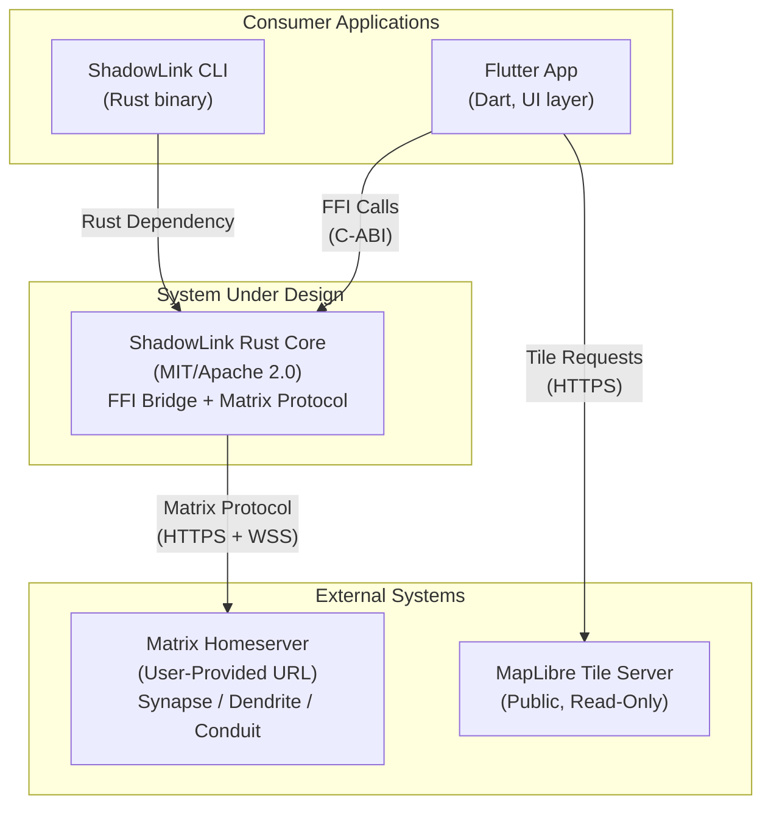
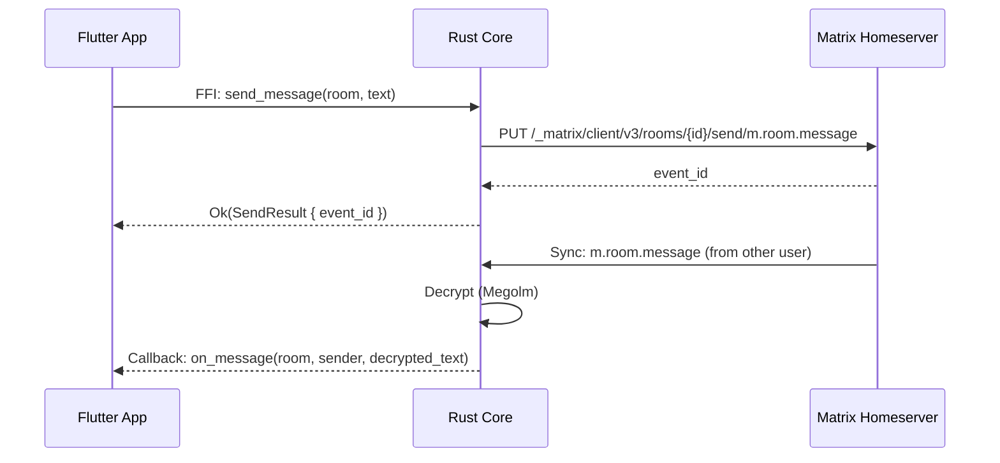

# 3. System Scope & Context

## 3.1 Business Context Diagram

## 3.2 External Interfaces

| System | Interface | Protocol | Direction |
|--------|-----------|----------|-----------|
| **Matrix Homeserver** | Matrix Client-Server API | HTTPS (REST) + WSS (Sync) | Rust Core → Homeserver |
| **Flutter App** | C-ABI FFI boundary | `extern "C"` function calls | Flutter → Rust Core |
| **ShadowLink CLI** | Rust crate dependency | `use shadowlink_rust_core` | CLI → Rust Core |
| **MapLibre Tiles** | Tile JSON + PBF | HTTPS | Flutter → Tile CDN |

The MapLibre tile interface is **outside** the Rust Core scope. The Flutter app consumes tiles
directly; the Rust core has no map rendering or tile fetching responsibilities.

## 3.3 System Scope

### In Scope ✅

- Matrix client lifecycle (login, session, logout)
- Room discovery, creation, join, invite, leave
- End-to-end encrypted messaging (text, images, media)
- Location event publishing and subscription
- Sync loop management with battery-aware scheduling
- E2EE key management and device verification
- FFI API surface design, error model, and memory contracts
- SpecKit behavioral specifications and automated test verification

### Out of Scope ❌

- User interface rendering (Flutter responsibility)
- Map display, tile fetching, geocoding (Flutter responsibility)
- App navigation flows, onboarding screens (Flutter responsibility)
- Theme/styling (Flutter responsibility)
- Push notification delivery (Flutter + platform responsibility)
- Homeserver administration or provisioning
- User account registration UX (protocol operations only)

## 3.4 Data Flow Summary

