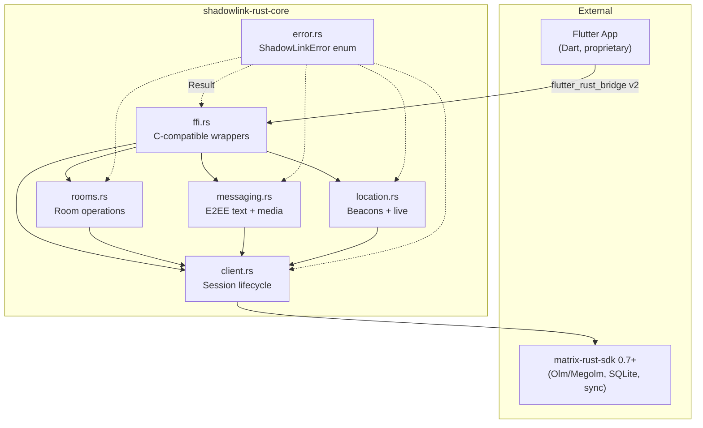
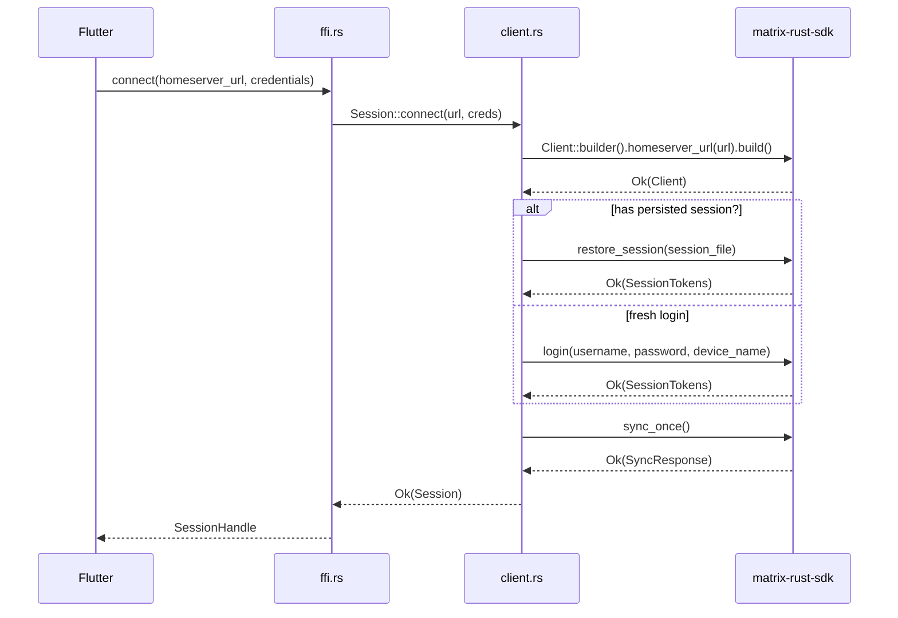

# 5. Building Block View

The crate decomposes into seven modules aligned with Matrix protocol domains and the FFI
boundary contract. Module boundaries follow Constitution §I (Clean Separation) — internal
refactors must not break the FFI surface — and §III (Minimal API Surface) — no module
exposes more than the Flutter app requires.

## 5.1 Component Diagram



**Data flow**: All operations flow Flutter → FFI → domain module → `client.rs` → SDK.
**Error flow** (dashed): Every fallible function returns `Result<T, ShadowLinkError>`,
propagating upward through the FFI layer and converted to Dart exceptions by
`flutter_rust_bridge`.

The `lib.rs` crate root declares all six submodules and re-exports the public types
needed by the FFI layer — it carries no business logic of its own.

Sync loop, E2EE key management, and persistence are **delegated entirely to
matrix-rust-sdk** — the crate does not contain a separate `sync` or `storage` module.
This keeps the module count lean and avoids duplicating SDK capabilities.

## 5.2 Module Interface Table

| Module | Responsibility | Key Types | User Stories |
|--------|---------------|-----------|--------------|
| `ffi.rs` | C-compatible wrappers for all crate operations; callback registration; type marshaling handoff to `flutter_rust_bridge` | `SessionHandle` | US1–US5 |
| `client.rs` | Homeserver connection, authentication, session restore, SDK client lifecycle | `Session` (wraps `matrix_sdk::Client`) | US1, US5 |
| `rooms.rs` | Room creation, invite acceptance, user invitation, room listing, leave | `RoomInfo`, `RoomState` | US2 |
| `messaging.rs` | E2EE text send/receive, media attachment send, message history, incoming message callbacks | `Message`, `MessageContent` | US3 |
| `location.rs` | Static location beacons, live location start/stop, location event callbacks | `LocationBeacon` | US4 |
| `error.rs` | Unified error enumeration covering all failure modes; `thiserror` derive for `Display` + `Error` impls | `ShadowLinkError` | US1–US5 |
| `lib.rs` | Crate root: module declarations, public re-exports, no business logic | — | — |

## 5.3 Level 2 White-Box: client.rs

The `client.rs` module owns the SDK lifecycle and serves as the dependency hub for all
other domain modules. Its internal structure:

### 5.3.1 `Session` Struct

```text
Session {
    inner: matrix_sdk::Client,       // SDK handle — all Matrix I/O flows through this
    homeserver_url: String,           // User-provided, never hardcoded (Constitution §II)
    user_id: Option<UserId>,          // Populated after successful login
}
```

The `Session` struct is the single point of SDK access. All domain modules receive
a reference to `Session` when performing operations. The SDK client internally manages
the sync loop, E2EE Olm/Megolm sessions, and retry logic — the crate does not duplicate
these.

### 5.3.2 `connect()` Flow



Key decisions:
- Builder pattern for SDK client construction — allows future configuration parameters
  (proxy, timeout) without breaking the FFI contract.
- `sync_once()` is called for initial sync; subsequent syncs are managed by the SDK's
  background sync loop, which `tokio` schedules.
- Session persistence path is derived from the consuming app's platform-specific
  data directory, passed into `connect()` as a parameter (Constitution §I).

### 5.3.3 `restore_session()` Detail

The SDK's built-in `SessionStore` (SQLite-backed) handles session token and sync token
persistence. On `restore_session()`:

1. SDK reads the SQLite database at the provided path.
2. If valid session tokens exist, the client authenticates without re-prompting.
3. If tokens are expired or the database is missing, returns
   `ShadowLinkError::SessionExpired` or `ShadowLinkError::StorageError`.
4. On success, the sync token is restored so the SDK can resume from the last known
   position — avoiding a full re-sync.

The E2EE key store (Olm sessions, Megolm inbound group sessions) lives in a separate
SQLite database managed by the SDK's `CryptoStore`. Both stores are opened atomically
during session restore.
