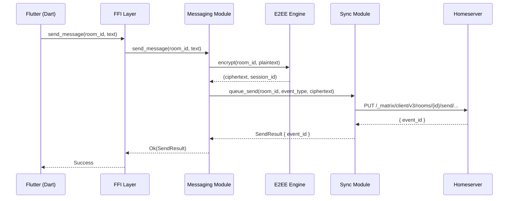

# 6. Runtime View 🔨

> **Status:** Runtime scenarios will be documented during the SpecKit Plan phase once the
> component model and async execution strategy are finalized. This section will cover the
> primary runtime flows with sequence diagrams.

## 6.1 Planned Scenarios

The following runtime scenarios have been identified for documentation:

| Scenario | Description | Priority |
|----------|-------------|----------|
| **Authentication Flow** | Login, session token handoff, session restore on cold start | P0 |
| **Message Send/Receive** | Encrypt → send → sync acknowledgement, inbound decrypt → callback | P0 |
| **Location Update Cycle** | Position capture → event publish → sync → subscriber notification | P1 |
| **Sync Loop Lifecycle** | Initial sync, incremental sync, retry/backoff, background suspension | P0 |
| **Room Join Flow** | Invite receipt → accept → state sync → ready notification | P1 |
| **E2EE Device Verification** | SAS verification, cross-signing bootstrap, key backup | P1 |
| **Error Propagation** | SDK error → core error translation → FFI error code → Dart exception | P0 |

## 6.2 Runtime Constraints

- All FFI calls from Flutter must be non-blocking from the Dart perspective.
- Sync loop runs on a dedicated tokio task with battery-aware scheduling.
- Background execution respects Android Doze/App Standby lifecycle.
- No busy-waiting or spin loops. All waiting uses async primitives.

## 6.3 Example: Message Send Flow (Draft)

> Details will be refined during implementation. Error paths, retry logic, and callback
> mechanics to be fully specified in the Plan phase.
