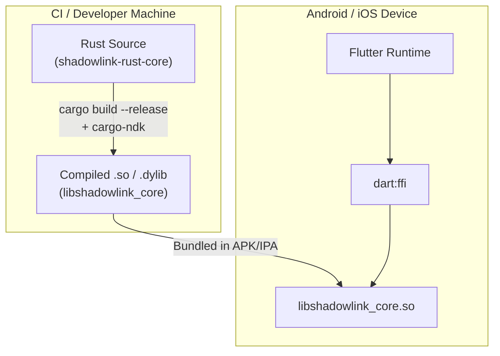

# 7. Deployment View 🔨

> **Status:** Deployment topology is straightforward for a library crate. This section will be
> expanded during the SpecKit Plan phase with build pipeline details, cross-compilation
> toolchains, and integration verification procedures.

## 7.1 Deployment Model

ShadowLink Rust Core is deployed as a **Rust library crate**, consumed by the Flutter application
at build time via FFI. It is not a standalone service, daemon, or binary.

## 7.2 Build Artifacts

| Platform | Artifact | Toolchain |
|----------|----------|-----------|
| Android arm64-v8a | `libshadowlink_core.so` | `cargo-ndk`, NDK 26+ |
| Android armeabi-v7a | `libshadowlink_core.so` | `cargo-ndk`, NDK 26+ |
| iOS aarch64 (future) | `libshadowlink_core.a` | `cargo-lipo`, Xcode |

## 7.3 Configuration

- The Rust core has **zero** hardcoded configuration values.
- Homeserver URL, credentials, and preferences are passed via FFI from the Flutter layer.
- No config files, no environment variables, no compile-time feature flags beyond target
  architecture selection.

## 7.4 Infrastructure Dependencies

- **None.** The Rust core requires no databases, caches, message queues, or cloud services
  beyond what matrix-rust-sdk manages internally (SQLite for session state).
- The user's Matrix homeserver is the only external runtime dependency and is configured
  entirely by the Flutter app.
