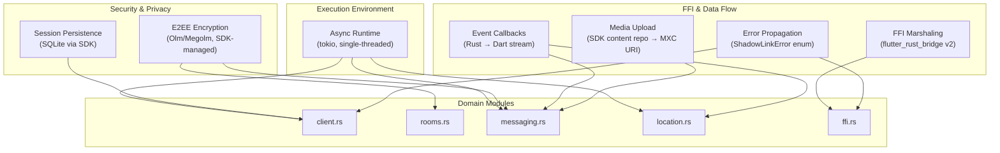
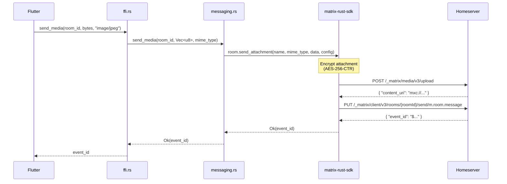

# 8. Cross-cutting Concepts

This section documents the architectural concepts that span module boundaries —
the runtime infrastructure, security model, and data flow patterns shared across
the entire crate. Each concept is resolved to a concrete implementation decision
made during Phase 4 (Plan).

## 8.1 Concept Map



## 8.2 Async Runtime (tokio)

**Decision**: Single-threaded `tokio` runtime, selected during Phase 4 research.

The matrix-rust-sdk requires a tokio runtime for its internal sync loop, HTTP
requests, and E2EE session management. We run a **single-threaded** executor:

- Reduces context-switch overhead on mobile CPUs (Constitution §V — Battery
  Discipline).
- Matrix operations are I/O-bound, not CPU-bound — parallelism offers no
  throughput benefit.
- `flutter_rust_bridge` v2 automatically converts Rust `async fn` return types
  to Dart `Future` objects, so the Flutter layer sees idiomatic async APIs
  without knowing about tokio.
- The runtime is initialized once in `client.rs` and shared across all domain
  modules via the `Session` struct.
- No raw `spawn_blocking` for CPU work — media encoding/decoding, if needed,
  is delegated to the Flutter layer or the SDK.

## 8.3 E2EE Encryption (Olm/Megolm)

**Decision**: Delegated entirely to matrix-rust-sdk. The crate never touches key
material.

The SDK's `e2e-encryption` feature activates Olm (device-to-device) and Megolm
(room-level) encryption. Key design choices:

- **Zero key exposure**: The crate never reads, stores, or transmits raw key
  material. All key management — generation, rotation, backup — is internal
  to the SDK's crypto store (Constitution §II, Security Requirements).
- **TOFU on first contact**: The SDK defaults to Trust On First Use. Messages
  from new devices are accepted and encrypted; the Flutter layer may later
  prompt for explicit device verification via the SDK's verification API.
- **Decryption failures**: If the SDK cannot decrypt a message (missing session
  key, corrupted olm session), it surfaces the error. The crate maps this to
  `ShadowLinkError::DecryptionFailed` and propagates it through the FFI layer.
  The Flutter app displays a security indicator — the message is not silently
  dropped.
- **Feature flags**: `matrix-sdk` is pulled in with features `e2e-encryption`,
  `sqlite`, and `qrcode` (for device verification QR codes).

## 8.4 Session Persistence (SQLite)

**Decision**: SDK's built-in SQLite store. Feature flag `bundled-sqlite` for Android.

The matrix-rust-sdk ships with a mature SQLite-backed persistence layer covering:

| Store | Contents | Managed By |
|-------|----------|-------------|
| State store | Sync tokens, room memberships, room state | SDK sync loop |
| Crypto store | Olm sessions, Megolm inbound group sessions, device keys | SDK crypto crate |
| Event cache | Recent room events for offline access | SDK event cache |

Implementation details:

- **Storage path**: Passed from the Flutter app at connect time (platform-specific
  app data directory). The crate never hardcodes paths (Constitution §II).
- **Android static linking**: The `bundled-sqlite` Cargo feature statically links
  SQLite into the Rust binary, avoiding runtime library dependencies on Android.
- **Storage errors**: If the SQLite database is corrupted or inaccessible,
  `client::connect()` returns `ShadowLinkError::StorageError` with details from
  the SDK's error type. The Flutter layer can offer a "clear and re-sync" recovery
  path.
- **Migration**: The SDK handles schema migrations transparently. No manual
  migration logic exists in this crate.

## 8.5 FFI Marshaling (flutter_rust_bridge v2)

**Decision**: `flutter_rust_bridge` v2 codegen generates all Dart↔Rust glue code.

This tool was selected over raw `dart:ffi` and `uniffi` for its async support and
rich type mapping:

| Rust Type | Dart Type | Notes |
|-----------|-----------|-------|
| `String` | `String` | UTF-8 validated at boundary |
| `Vec<u8>` | `Uint8List` | Zero-copy; critical for media throughput |
| `Option<T>` | `T?` | Nullable on Dart side |
| `Result<T, E>` | Returns `T`, throws exception on `Err(E)` | Error → Dart exception |
| Rust enum | Dart sealed class | Pattern-matched exhaustively |
| `async fn` | `Future<T>` | Transparent async bridging |
| `Stream<T>` | `Stream<T>` | For incoming events (messages, location) |

Key guarantees:

- No manual `unsafe` FFI code in this crate. All `extern "C"` wrappers are
  generated by flutter_rust_bridge.
- Memory ownership is determined by the bridge: Rust types are dropped when Dart
  GC collects the corresponding objects, preventing use-after-free and double-free.
- Zero-copy for `Vec<u8>` means media bytes are not duplicated during transfer —
  critical for battery and latency on mobile (Constitution §V).

## 8.6 Error Propagation (ShadowLinkError)

**Decision**: `thiserror` derive macro generates `Display` and `Error` impls.
Single unified error enum.

The `ShadowLinkError` enum covers all failure modes across the crate:

```text
ShadowLinkError
├── ConnectionFailed { message: String }
├── AuthenticationFailed { message: String }
├── SessionExpired
├── NotInRoom { room_id: String }
├── DecryptionFailed { event_id: String }
├── MediaTooLarge { limit_bytes: u64 }
├── LocationUnavailable
├── StorageError { message: String }
└── InternalError { message: String }
```

Design principles:

- **Single error path** (Constitution §III): Every fallible operation returns
  `Result<T, ShadowLinkError>`. No parallel error reporting channels, no raw
  string errors.
- **FFI translation**: `flutter_rust_bridge` converts `Err(ShadowLinkError)` to
  a Dart exception. The Dart side can `catch` and inspect the error variant.
- **No panics across FFI**: `catch_unwind` guards are placed at the FFI boundary
  to prevent Rust panics from unwinding into Dart frames. Any unexpected panic
  is converted to `ShadowLinkError::InternalError`.
- **Privacy-safe errors**: Error messages contain no plaintext message content,
  keys, or access tokens — only structural identifiers (room ID, event ID) and
  human-readable descriptions suitable for display.

## 8.7 Event Callbacks (Rust → Dart)

**Decision**: `flutter_rust_bridge` stream-based delivery for async events.

Incoming events (new messages, location updates, room invites) arrive on the
SDK's sync loop and must be delivered to the Flutter layer. Two mechanisms:

1. **Streams (primary)**: The Rust side returns a `Stream<Event>` that
   flutter_rust_bridge maps to a Dart `Stream`. The Flutter layer listens and
   updates the UI reactively. This is the recommended pattern for continuous
   event flows.

2. **Registered callbacks (fallback)**: For cases where streams are impractical,
   Dart registers `extern "C"` function pointers that Rust calls on each event.
   Callbacks must be `Send + 'static` to cross the async boundary safely.

All event delivery is **fan-out**: a single SDK sync event may trigger multiple
domain callbacks (e.g., a room message triggers both the messaging callback and
a notification preview). This fan-out happens inside the Rust crate, keeping
the Dart side simple.

## 8.8 Media Upload Pipeline

**Decision**: Delegated to the SDK's content repository API. No custom HTTP logic.

The full media pipeline:



Key aspects:

- Media is encrypted **before upload** by the SDK (AES-256-CTR with separate
  key and IV). The homeserver never sees plaintext media.
- The returned `mxc://` URI is embedded in the Matrix event body. Receiving
  clients use it to download and decrypt the media.
- **Size limits**: The homeserver enforces upload size limits (configured in
  Synapse's `max_upload_size`). If exceeded, the SDK returns an error that
  the crate maps to `ShadowLinkError::MediaTooLarge` with the server-reported
  limit in bytes.
- The crate does not implement chunked upload or resumable transfers — these
  are deferred to a future SDK version or a separate crate feature.

## 8.9 Constitution Cross-Reference

| Concept | Constitutional Principle |
|---------|--------------------------|
| Async Runtime (tokio, single-threaded) | V. Battery & Permission Discipline |
| E2EE Encryption (Olm/Megolm, SDK-managed) | II. Local-First Privacy; Security Requirements |
| Session Persistence (SQLite via SDK) | II. Local-First Privacy |
| FFI Marshaling (flutter_rust_bridge v2) | I. Clean Separation; III. Minimal API Surface |
| Error Propagation (ShadowLinkError enum) | III. Minimal API Surface |
| Event Callbacks (Rust → Dart streams) | I. Clean Separation |
| Media Upload (SDK content repo) | III. Minimal API Surface |
