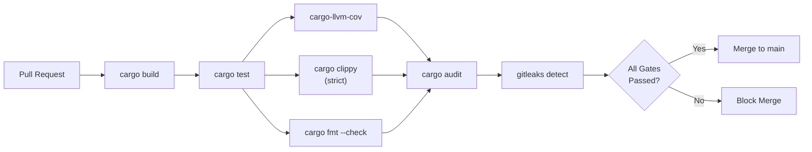

# 10. Quality Requirements

## 10.1 Quality Tree

```mermaid
graph TD
    Q["ShadowLink Rust Core\nQuality Goals"]
    Q --> Perf["Performance"]
    Q --> Sec["Security"]
    Q --> Test["Testability"]
    Q --> Maint["Maintainability"]
    Q --> Port["Portability"]

    Perf --> P1["Connection\n&lt; 2s"]
    Perf --> P2["Message Delivery\n&lt; 500ms"]
    Perf --> P3["Session Restore\n&lt; 1s"]
    Perf --> P4["Sync Idle CPU\n&lt; 1%"]
    Perf --> P5["Binary Size\n&lt; 8 MB per ABI"]

    Sec --> S1["E2EE Verification\nRequired"]
    Sec --> S2["No Plaintext\nSecrets on Disk"]
    Sec --> S3["Gitleaks\nCI Gate"]
    Sec --> S4["Dependency Audit\ncargo-audit"]

    Test --> T1["SpecKit Contracts\n→ Assertions"]
    Test --> T2["cargo-llvm-cov\nCoverage Tracking"]
    Test --> T3["CI Gate\nAll Tests Pass"]
    Test --> T4["Deterministic\nNo Flaky Tests"]

    Maint --> M1["arc42\nLiving Docs"]
    Maint --> M2["Conventional\nCommits"]
    Maint --> M3["Semantic\nVersioning"]
    Maint --> M4["clippy Strict\nCI Gate"]

    Port --> Port1["Android\narm64-v8a"]
    Port --> Port2["Android\narmeabi-v7a"]
    Port --> Port3["iOS aarch64\n(Future)"]
```

## 10.2 Quality Scenarios

### Performance

| ID | Scenario | Stimulus | Response | Measure |
|----|----------|----------|----------|---------|
| **P-S1** | Cold start connection | User opens app | Establish Matrix session, complete initial sync | &lt; 2 seconds to "ready" state |
| **P-S2** | Message send | User sends text message | Encrypt, dispatch, receive `event_id` | &lt; 500ms end-to-end |
| **P-S3** | Session restore | App returns from background | Resume sync, process missed events | &lt; 1 second to catch-up complete |
| **P-S4** | Idle sync | App in background | Maintain sync loop with minimal wakeups | &lt; 1% CPU averaged over 1 hour |
| **P-S5** | Binary footprint | APK build | Compiled `.so` per target ABI | &lt; 8 MB stripped |

### Security

| ID | Scenario | Stimulus | Response | Measure |
|----|----------|----------|----------|---------|
| **S-S1** | Unverified device | New device joins room | Require interactive SAS verification | Verification must complete before messages decrypt |
| **S-S2** | Secret storage | Session token persisted | Encrypt-at-rest via matrix-rust-sdk store | No plaintext tokens in filesystem dump |
| **S-S3** | Accidental commit | Developer stages secrets | gitleaks pre-commit hook + CI gate | Build fails, merge blocked |
| **S-S4** | Dependency vulnerability | CVE in transitive dep | `cargo audit` in CI | Alert on `critical`/`high` severity |

### Testability

| ID | Scenario | Stimulus | Response | Measure |
|----|----------|----------|----------|---------|
| **T-S1** | Spec verification | New component implemented | Run SpecKit-derived test suite | All assertions pass |
| **T-S2** | Coverage tracking | PR submitted | `cargo-llvm-cov` generates report | Coverage trend visible in CI |
| **T-S3** | Regression detection | Bug fix merged | Existing tests continue passing | No regressions |
| **T-S4** | Determinism | Test suite run 10x consecutively | Same pass/fail result every run | Zero flaky tests tolerated |

### Maintainability

| ID | Scenario | Stimulus | Response | Measure |
|----|----------|----------|----------|---------|
| **M-S1** | Architecture change | Module restructured | arc42 section updated in same PR | Docs and code always in sync |
| **M-S2** | Commit hygiene | Any code change | Conventional Commits format | Enforced by CI |
| **M-S3** | Breaking change | FFI API surface altered | Major version bump per semver | `Cargo.toml` version incremented |
| **M-S4** | Code quality | PR submitted | `clippy` strict lint gate | Zero warnings |

### Portability

| ID | Scenario | Stimulus | Response | Measure |
|----|----------|----------|----------|---------|
| **Port-S1** | Android build | `cargo build --target aarch64-linux-android` | Produces valid `.so` | Loads via `dart:ffi` without errors |
| **Port-S2** | iOS build (future) | `cargo build --target aarch64-apple-ios` | Produces valid `.a` | Links into Flutter iOS runner |
| **Port-S3** | Host test | `cargo test` on Linux/macOS dev machine | Full test suite runs | Identical pass/fail to CI |

## 10.3 Quality Gates (CI Pipeline)

