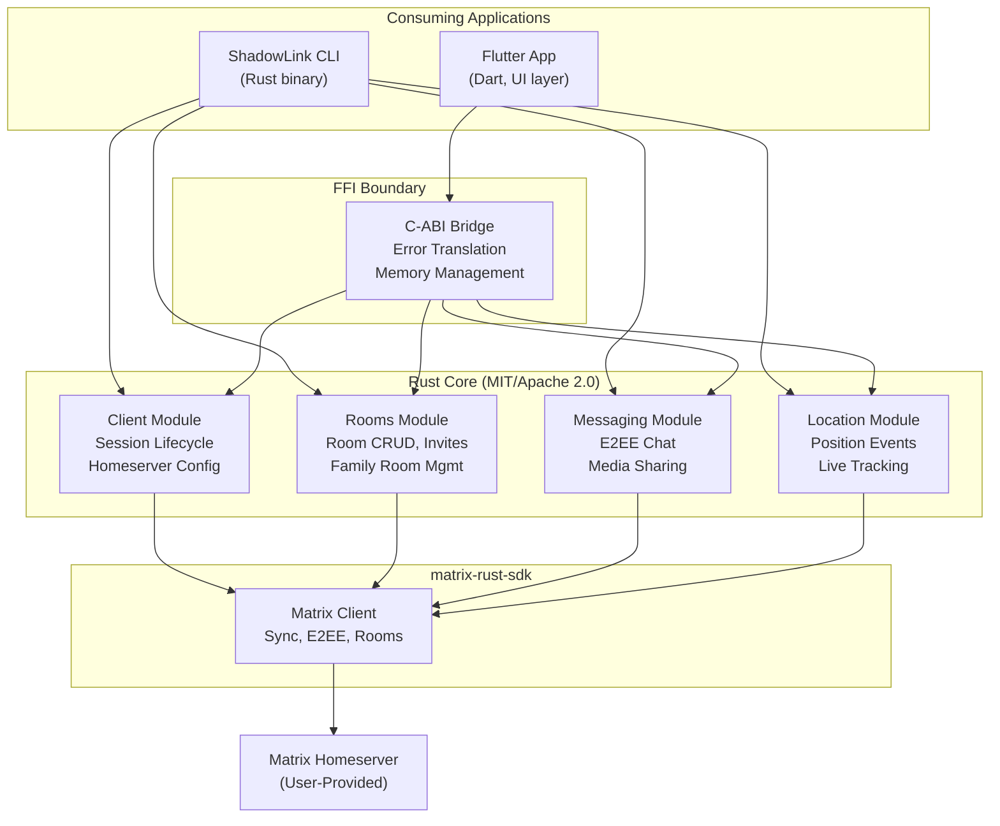

# arc42 Architecture — ShadowLink Rust Core

System overview and architectural decision framework for the ShadowLink Rust Core library — a
privacy-first Matrix protocol bridge consumed by Flutter applications (via FFI) and the ShadowLink CLI (via direct Rust dependency).

## System Block Diagram

## Table of Contents

| # | Section | Status |
|---|---------|--------|
| [1](./01-introduction-and-goals) | Introduction & Goals | ✅ |
| [2](./02-architecture-constraints) | Architecture Constraints | ✅ |
| [3](./03-system-scope-and-context) | System Scope & Context | ✅ |
| [4](./04-solution-strategy) | Solution Strategy | ✅ |
| [5](./05-building-block-view) | Building Block View | 🔨 |
| [6](./06-runtime-view) | Runtime View | 🔨 |
| [7](./07-deployment-view) | Deployment View | 🔨 |
| [8](./08-concepts) | Cross-cutting Concepts | 🔨 |
| [9](./09-architecture-decisions) | Architecture Decisions | 🔨 |
| [10](./10-quality-requirements) | Quality Requirements | ✅ |
| [11](./11-risks-and-technical-debt) | Risks & Technical Debt | ✅ |
| [12](./12-glossary) | Glossary | ✅ |

**Legend:** ✅ Complete &nbsp;|&nbsp; 🔨 Populated during SpecKit Plan phase

## Document Conventions

- **YAML frontmatter** on every page for VitePress integration.
- **Mermaid.js** for all structural diagrams (graph TB for architecture, graph TD for hierarchies).
- **arc42 template** follows German engineering conventions: factual, structured, zero fluff.
- **Line width** capped at ~100 characters for diff-friendliness and terminal readability.
